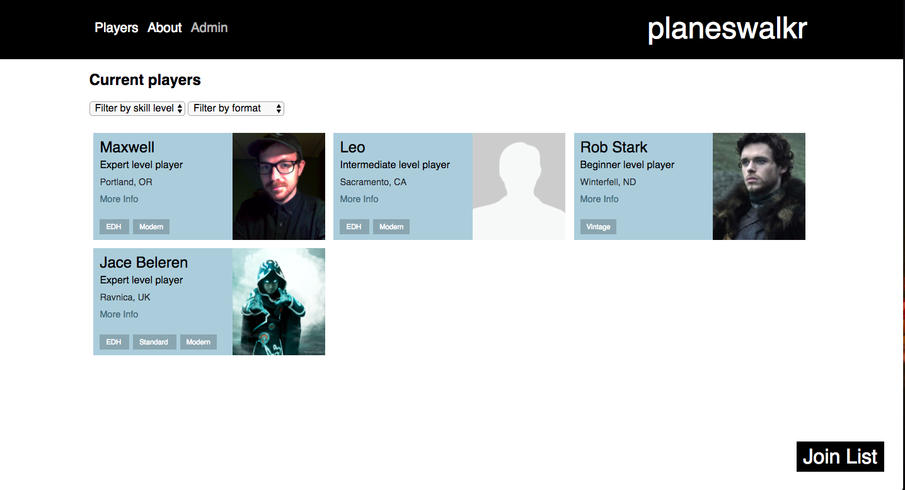

# Planeswalkr
### By Maxwell Cady
### 01/27/2017

## Description
A Magic The Gathering player database. Users are able to view all added players, and add themselves as a player. Admin can also edit properties of player and delete the player. User can also filter players using skill level and formats.

## Technologies Used
* Angular 2
* Angular CLI
* Firebase
* Sass

This project was generated with [angular-cli](https://github.com/angular/angular-cli) version 1.0.0-beta.26.

## Installation
* clone project using git
* `cd planeswalkr`
* `npm install`

## Development server
Run `ng serve` for a dev server. Navigate to `http://localhost:4200/`. The app will automatically reload if you change any of the source files.

## Code scaffolding

Run `ng generate component component-name` to generate a new component. You can also use `ng generate directive/pipe/service/class/module`.

## Build

Run `ng build` to build the project. The build artifacts will be stored in the `dist/` directory. Use the `-prod` flag for a production build.

## License
GPL 2017
